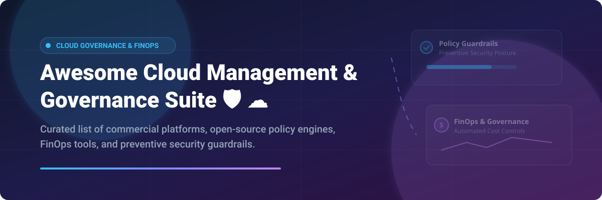

# Awesome-Cloud-Management-Governance-Suite

# Awesome-Cloud-Management-Governance-Suite 🛡️ ☁️



  





  
  
  
  
  
  



---

## 🌟 Top Cloud Management & Governance Suite Ecosystem

**Curated List of Commercial Cloud Governance Platforms & Open-Source Policy Engines**  
*Focused on Policy as Code, Multi-Cloud Guardrails, FinOps Automation, Preventive Controls & Self-Hosted Governance Engines*

**Last updated: October 2026** 📅

---

### 📌 Overview & SEO Summary
Welcome to the ultimate curated directory of **cloud management and governance platforms**, **open-source policy engines**, and **multi-cloud guardrail frameworks**. Whether you are looking for enterprise-grade commercial solutions (such as *Turbot Guardrails*, *CloudBolt*, and *CoreStack*), or self-hostable open-source alternatives (like *Cloud Custodian* and *Scalr*), this list covers category leaders, preventive security posture management, and privacy-respecting governance automation.

---

## 📑 Table of Contents
- [🏢 SaaS & Commercial Platforms](#-saas--commercial-platforms)
- [🔓 Open-Source GitHub Projects](#-open-source-github-projects)
- [🛠️ How to Contribute](#%EF%B8%8F-how-to-contribute)
- [📊 Star History](#-star-history)
- [🤝 Support & Sponsorship](#-support--sponsorship)
- [⚠️ Disclaimer](#%EF%B8%8F-disclaimer)

---

## 🏢 SaaS / Commercial Platforms

The cloud management and governance market spans **hyperscaler native tools** (AWS Systems Manager, Azure Policy, Google Cloud Operations) that provide baseline governance at consumption-based pricing, and **specialized third-party platforms** (Turbot, CloudBolt, CoreStack) that offer unified multi-cloud control planes with advanced automation. **Turbot Guardrails** introduced **Preventive Security Posture Management (PSPM)** in 2026, shifting from reactive detection to **blocking risky changes before they reach cloud environments**, with prevention maturity scoring from Level 0 to Level 5 . **CloudBolt CMP** is **free for up to 100 resources** and supports **25+ cloud providers and hypervisors** with intelligent orchestration and ML-powered FinOps . **CoreStack** positions itself as an **AI-powered Agentic Governance OS** with measurable results including **20–50% cloud cost reduction, 40% operational efficiency increase, and 30–50% compliance cost reduction** . **Flexera Cloud Management Platform** serves **50,000+ customers** with hybrid IT estate visibility and governance .

| SaaS / Commercial Platform | Company / Owner | Valuation / Market Cap | Standard Edition Starting Price | Free Tier / Free Trial Limits | Description |
| :--- | :--- | :--- | :--- | :--- | :--- |
| **[AWS Management Tools](https://aws.amazon.com/products/management-tools/)** ☁️ | Amazon | ~$2.0 Trillion | **Consumption-based** for underlying AWS services | **Free tier for some services** | **AWS-native management suite** — **Systems Manager** for operational management (Session Manager, State Manager, Automation, Patch Manager, Compliance) . **Explorer** for operational dashboards, **OpsCenter** for operational work items, **Incident Manager** for incident response, and **Change Manager** for change approval workflows . |
| **[Azure Policy & Management](https://azure.microsoft.com/en-us/products/azure-policy/)** 🔷 | Microsoft | ~$3.90 Trillion | **Free for Azure Policy**; pay for underlying resources | **Free forever** for policy evaluation | **Azure-native governance** — **Policy definitions, initiatives, and assignments** enforce organizational standards at management group, subscription, or resource group scope . **Deny, audit, modify, and deployIfNotExists** effects. **Azure RBAC** for access control with granular permissions for management and governance operations . |
| **[Google Cloud Operations Suite](https://cloud.google.com/products/operations)** 🌐 | Google (Alphabet) | ~$2.0 Trillion | **Consumption-based** for logs, metrics, and traces | **$300 free credits** for new customers | **GCP-native observability and operations** — **Cloud Logging** for log aggregation and analysis, **Cloud Monitoring** for metrics and alerting, **Cloud Trace** for distributed tracing, **Cloud Debugger** for production debugging, and **Cloud Profiler** for continuous code profiling . **SLO Monitoring** for service level objectives . |
| **[Turbot Guardrails](https://turbot.com/guardrails)** 🛡️ | Turbot | Private | **SaaS: $0.05/control/month** (metered); **Enterprise: $0.10/active control**   | **2-week free trial** (SaaS)   | **Preventive Security Posture Management (PSPM)** — **Blocks risky changes before deployment** rather than detecting after . **Prevention maturity scoring** (Level 0–5) against CIS and NIST benchmarks. **Policy Simulator** tests against real CloudTrail data. **Control packs** from $25K (SaaS) or $50K (Enterprise) . |
| **[CloudBolt CMP](https://www.cloudbolt.io/)** 🎛️ | CloudBolt Software | Private | **Free for up to 100 resources**; custom enterprise pricing   | **Free: up to 100 resources**   | **Unified cloud management platform** — **25+ cloud providers and hypervisors** including AWS, Azure, GCP, Oracle Cloud, VMware, Hyper-V, Nutanix, OpenStack, and Kubernetes . **200+ integrations** spanning ITSM, IPAM, DNS, identity, monitoring, backup, and IaC. **Role-based self-service** with policy guardrails and automated provisioning. |
| **[Flexera Cloud Management Platform](https://www.flexera.com/)** 📊 | Flexera | Private (est. ~$500M revenue) | **Custom enterprise pricing**; no free version   | **No free trial**   | **Hybrid IT management platform** — **50,000+ customers** with **definitive visibility into complex hybrid IT ecosystems** . **Cost, usage, and optimization insights** across cloud and on-premises. **Governance capabilities** with actionable recommendations. Users report **depth and reliability of insights** as top strength. |
| **[Morpheus Data](https://morpheusdata.com/)** 🔮 | Morpheus Data | Private | **Quote-based, custom pricing**   | **Demo available** | **Cloud management platform** — **Self-service provisioning with policy guardrails** . Integrates with **VMware, Nutanix, Azure, AWS, GCP**, and more. **Custom pricing engine** with USN currency support for chargeback . **Terraform provider** for infrastructure-as-code management . |
| **[Apptio Cloudability](https://www.apptio.com/products/cloudability/)** 💰 | IBM (Apptio) | ~$200 Billion (IBM) | **Percentage of cloud spend**; overage fees $1,930–$4,410 per unit   | **No free tier** | **Cloud financial management** — **Advanced chargeback** with flexible price books to re-rate spend across business units . **Integration with IBM Turbonomic** for automated optimization decisions . **Hidden costs**: implementation, training, and limited automation vs manual effort . |
| **[CoreStack](https://www.corestack.io/)** 🤖 | CoreStack | Private | **Tier 1: $1,000/month** (up to $600K cloud spend); **Tier 2: $2,500/month** ($600K–$1.5M); **Tier 3: $108,200/year** ($1.5M–$6M)   | **Free trial available** | **AI-powered Agentic Governance OS** — **Unifies FinOps, SecOps, CloudOps, and compliance** in a single control plane . **LCGM (Large Cloud Governance Model)** for agentic insights. **Measurable results**: 20–50% cloud cost reduction, 40% operational efficiency increase, 30–50% compliance cost reduction . |
| **[Scalr](https://scalr.io/)** ⚙️ | Scalr | Private | **Free: up to 50 runs/month**; **Enterprise: starting at 20,000 runs/year**   | **Free: 50 runs/month**   | **Terraform and OpenTofu automation platform** — **Drop-in replacement for Terraform Cloud** with feature parity . **GitOps workflows** with VCS/PR automation. **OPA policy enforcement**, drift detection, and **keyless authentication via OIDC** . **No per-user fees, no per-resource charges** . |

---

## 🔓 Open-Source GitHub Projects

*Sorted by GitHub_Stars_Count (Descending)* 🌟

- **[Cloud Custodian](https://github.com/cloud-custodian/cloud-custodian)**   
  **Rules engine for cloud security, cost optimization, and governance**, Apache-2.0 licensed. **CNCF Incubating Project** celebrating **10 years of production use** in 2026 . **Stateless policy engine** with **unified YAML DSL** for AWS, Azure, GCP, Oracle Cloud, Kubernetes, and Terraform . **Real-time compliance enforcement** with automated remediation. **Cost management** including off-hours resource scheduling and garbage collection of unused resources . **Thousands of community-vetted policy actions and filters** . **Shift-left governance** integrates with Terraform for compliance from deployment. **The foundational open-source cloud governance engine** — used by organizations worldwide for FinOps, security, and compliance . 🛡️

- **[Qubiva](https://github.com/qubiva/qubiva)**   
  **Self-hosted Kubernetes-native cloud governance platform**, open-source. **Unifies IaC execution, cloud discovery, compliance scanning, OPA policy enforcement, operational workflows, and AI tooling** into a single platform . **Infrastructure as Code**: OpenTofu/Terraform execution with state management and real-time log streaming. **Cloud Discovery**: Query live resources using SQL across AWS, Azure, and GCP. **Compliance**: CIS, SOC 2, HIPAA, PCI DSS, NIST 800-53 with OPA/Conftest policy checks. **AI Governance**: Integrated LiteLLM proxy for LLM spend tracking and virtual key access control. **Enterprise Features**: SAML 2.0 SSO, RBAC, audit trails . **The most comprehensive open-source cloud governance platform** — no vendor lock-in, fully self-hosted. 🚀

- **[Scalr (Open Core)](https://github.com/Scalr/terraform-provider-scalr)**   
  **Terraform and OpenTofu automation platform**, MPL-2.0 licensed. **Free tier: up to 50 runs/month** . **Fully compatible with Terraform/OpenTofu CLI and TFC API** — existing workflows work unchanged . **Remote operations backend** executing runs and storing state centrally. **GitOps workflows** with apply-before-merge and rich PR integration. **OPA policy enforcement**, drift detection, and **keyless authentication via OIDC** . **Scalr AI** explains run errors and summarizes plans. **MCP Server** for querying workspaces and auditing IAM from AI assistants . ⚙️

- **[Azure Policy as Code Workflows](https://github.com/Azure/azure-policy)**   
  **Azure Policy definitions, initiatives, and assignments**, MIT licensed. **Manage Azure Policy resources as code** with manual reviews on changes to policy definitions, initiatives, and assignments . **Start with audit effects** instead of enforcement to track policy impact before enforcing . **Create definitions at higher levels** (management group) and assignments at child levels. **Built-in policies** for allowed locations, resource types, SKUs, and tag enforcement . 📋

- **[cfripper](https://github.com/Skyscanner/cfripper)**   
  **Library and CLI tool for analysing CloudFormation templates and checking them for security compliance**, Apache-2.0 licensed. **388 stars, 52 forks** . **Security compliance checking** for AWS CloudFormation templates. **CLI and library** for integration into CI/CD pipelines. **The standard tool for shift-left governance on CloudFormation** . 🔍

- **[cloud-governance (Red Hat Performance)](https://github.com/redhat-performance/cloud-governance)**   
  **Next generation of cloud management and security**, open-source. **10 stars, 12 forks** . **Automates cloud infrastructure audit and remediation** to improve governance posture and reduce risk, cost, and environmental footprint. **Python-based** governance automation. 🌱

- **[li10-governance](https://github.com/li10labs/li10-governance)**   
  **Cloud infrastructure audit and remediation automation**, open-source. **4 stars** . **Improves cloud governance posture** and reduces risk, cost, and environmental footprint. **Python-based** with 311 KB codebase. 🔧

- **[terraform-azurerm-policy](https://github.com/globalbao/terraform-azurerm-policy)**   
  **Terraform modules for AzureRM Policies, PolicySets, and Assignments**, MIT licensed. **16 stars, 18 forks** . **Custom and built-in policies** for Azure Governance. **Infrastructure-as-code approach** to Azure Policy management. 📐

- **[safe-policy-rollout-gitops](https://github.com/thisisshi/safe-policy-rollout-gitops)**   
  **Safe Policy Rollouts with GitOps**, open-source. **Kubecon NA 2021 presentation code** . **GitOps-based policy deployment** for Kubernetes with safety mechanisms. 🎯

- **[cloudcustodian-policies (S3 Governance)](https://github.com/sahanasj/cloudcustodian-policies)**   
  **Cloud Custodian policies for AWS Cloud Governance (S3)**, open-source. **Practical example** of Cloud Custodian policy implementation for S3 bucket governance . 📦

---

## 🛠️ How to Contribute

Contributions are welcome! Follow these steps to submit new cloud governance platforms or open-source policy engines:

1. 🍴 **Fork** the repository.
2. 📝 **Add/edit** entries in `README.md` maintaining table/list structure and formatting.
3. 🔗 Include project title, official website/GitHub link, exact Stars_Count, license, and brief description.
4. 🚀 Submit a **Pull Request** with a descriptive summary of your changes.

---

## 📊 Star History



---

## 🤝 Support & Sponsorship

If you find this cloud management and governance repository useful, please consider supporting the project:

- ⭐ **Star** this repository to increase visibility!
- 🔀 **Fork** and share with fellow platform engineers, security teams, and open-source advocates.
- ☕ **Sponsor & Buy Me a Coffee**: Support ongoing open-source curation via the [GitHub Sponsor Dashboard](https://github.com/sponsors/ishandutta2007).

---

## ⚠️ Disclaimer

- This is a **community-curated** list — not exhaustive and not an endorsement. ℹ️
- **Cloud Custodian is the dominant open-source governance engine** — CNCF Incubating Project with **10 years of production use** and **thousands of community-vetted policies** . It provides **real-time compliance enforcement, cost management, and shift-left governance** across AWS, Azure, GCP, Oracle Cloud, Kubernetes, and Terraform .
- **Turbot Guardrails PSPM shifts from detection to prevention** — blocking risky changes before deployment rather than discovering misconfigurations after . **Prevention maturity scoring (Level 0–5)** against CIS and NIST benchmarks provides measurable governance posture. **Control packs start at $25K (SaaS) or $50K (Enterprise)** with **Premium Support at 20% of usage** and **Premium+ at 30%** .
- **CloudBolt CMP is free for up to 100 resources** — a generous entry point for smaller deployments . **CoreStack Tier 1 at $1,000/month** covers up to **$600K annual cloud spend**, making it accessible for mid-market .
- **Apptio Cloudability overage fees** range from **$1,930 (Essentials) to $4,410 (Premium) per unit** — a 20% spend growth mid-year can add tens of thousands in unplanned fees . **Limited automation** means recommendations require manual implementation.
- **Open-source platforms (Cloud Custodian, Qubiva, Scalr) are not turnkey** — they require **deployment, configuration, and ongoing maintenance**. **Qubiva unifies IaC, discovery, compliance, and AI governance** but requires **Kubernetes expertise** . **Always validate governance controls against your specific compliance requirements** before production deployment. 🛡️

---



  <b>Made with ❤️ for platform engineers, security teams, and open-source cloud governance advocates.</b>

